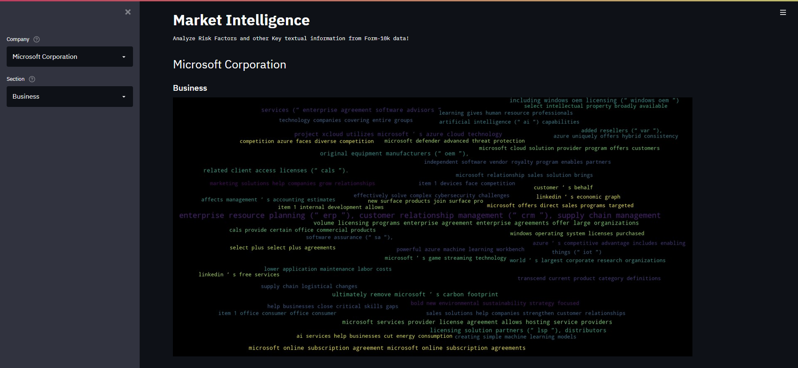

# Form10kAnalyzer
A utility to assess a firm's risk exposure and other financial and operational performance over the past year. The utility leverages the firm's Form 10-K and extracts key sections from it, while performing various Natural Language Processing techniques to bring out key topics and themes.

Use the Form10kExtractor and Form10KAnalyzer classes to extract and analyze the textual information available in the 10k reports of publicly listed companies in the US.

Alternatively you can use the streamlit dashboard to interatively select companies and get insights from each section of the 10k report.

## Steps to view streamlit dashboard

* Clone/Download the repository

On your command prompt:

* Change directory to the folder where the repository is cloned/downloaded `cd <path to repository>`

* Create a virtual environment `conda create -n <environment name> python=3.9 jupyter`

* Activate the virtual environment `conda activate <environment name>`

* Install the dependancies `pip install -r requirements.txt`

* Type `streamlit run src/app.py`

* You should be able to view the interactive streamlit dashboard

